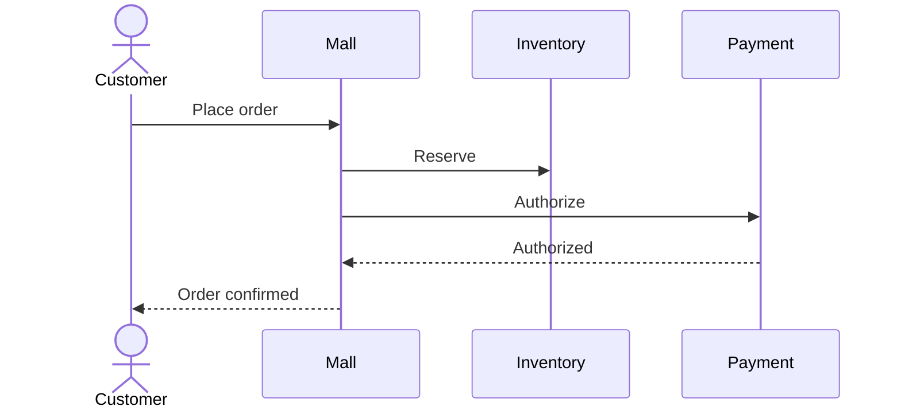

# UC-NN: <Tên Use Case>

| Trường | Giá trị |
|---|---|
| **Loại** | Use Case |
| **Trạng thái** | Draft / Review / Approved |
| **Phiên bản** | 1.0.0 |
| **Cập nhật** | YYYY-MM-DD |
| **Owner** | <Team> |

## 1. Mục đích

<1-2 câu mô tả use case này phục vụ mục đích nghiệp vụ gì.>

## 2. Actor & Tiền điều kiện

| | |
|---|---|
| **Actor chính** | <Customer / Operator / System> |
| **Actor phụ** | ... |
| **Tiền điều kiện** | <Customer logged in, có cart, ...> |

## 3. Luồng chính (Happy path)

| # | Actor | Hành động | Phản hồi hệ thống | Service liên quan | Event emit |
|---|---|---|---|---|---|
| 1 | Customer | ... | ... | `<service>` | `<event>` |
| 2 | System | ... | ... | `<service>` | `<event>` |

## 4. Luồng thay thế / Edge cases

### A1: <Tên edge case>
<Mô tả flow khi điều kiện X xảy ra.>

### A2: <Tên edge case>
...

## 5. Hậu điều kiện

<Trạng thái cuối sau khi use case hoàn thành.>

## 6. Yêu cầu chức năng liên quan

| ID | Mô tả |
|---|---|
| `<DOMAIN>-FR-NNN` | ... |

## 7. Sơ đồ

## 8. Liên kết

- Services: [`<service-name>`](../20-services/<service-name>/README.md)
- ADR: ADR-NNNN
- Events: [event catalog](../60-reference/events/README.md)
